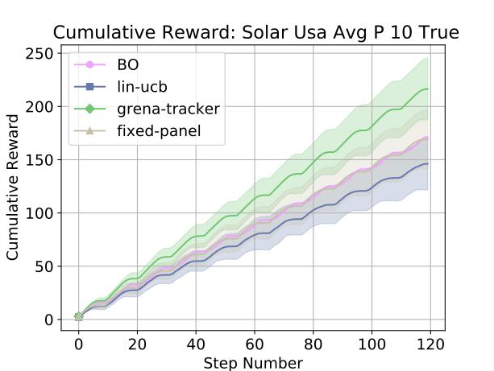

# solar_panels_rl

This is a fork from (https://github.com/david-abel/solar_panels_rl).

## Changes:

Example implementation using Bayesian optimisation in BoTorch for solar panel control.

Changes from orignal repository:
* Inclusion of requirements file to ease reproducibility (we found that not all versions of simple_rl were compatible).
* Made compatible with Python 3.6 (required for BoTorch).
* Basic implementation of agent using Bayesian optimisation. Note that the implementation is slow and uses random subsampling.
* Example results for BO (see below). Because the BO implementation is slow we changed the default experiment settings to make the experiment shorter.

### Example

To run the example, navigate to the directory `experiments` and run `python run_all_experiments.py`

## Original:

Code associated with our paper:

"[Bandit-Based Solar Panel Control](http://cs.brown.edu/~dabel/papers/iaai_solar_bandit.pdf)" presented at IAAI 2018, with earlier versions of the paper appearing at [RLDM 2017](http://cs.brown.edu/~dabel/papers/solarl.pdf) and [EnviroInfo 2017](http://cs.brown.edu/~dabel/papers/solarl_enviro_info.pdf).

This work focuses on applying reinforcement learning techniques to improve Solar Tracking.

Experiments require [pysolar](http://pysolar.org/) version [0.6](https://github.com/pingswept/pysolar/releases/tag/0.6), and [simple_rl](https://github.com/david-abel/simple_rl), which can be installed with the usual:

	pip install simple_rl

## Example

To reproduce plots from the IAAI paper, simply run the _run_all_experiments.py_ in _experiments_.

Contact david_abel@brown.edu with any questions.
